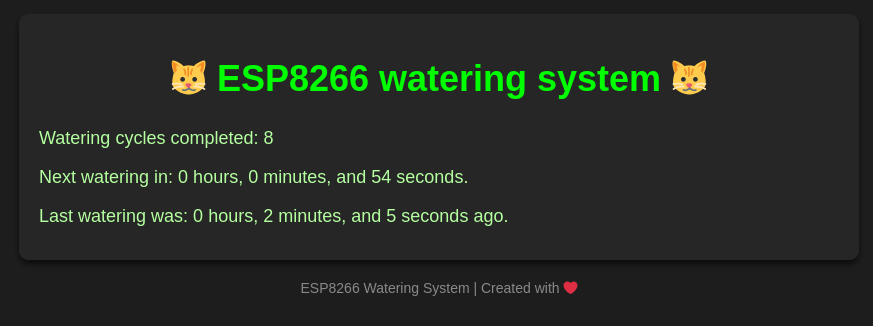

# Automatic Plant Watering System

 Minimalist program for an automatic plant watering system, controlled via an ESP32/ESP8266. The system can be monitored remotely through a web interface.

## Features

- **Automatic Watering**: The system waters the plants at regular intervals.
- **Pseudo Real-Time Monitoring**: The web interface displays the remaining time until the next watering, the time elapsed since the last watering and total number of completed watering cycles. The counters on the web interface are updated using a mix of local management and server requests to minimize network dependency for monitoring.
- **Resilience to restarts/power outages**: The internal flash is used to periodically save the system's state, allowing it to restore the state after a restart.
- **Fully configurable**: Almost everything is configurable through macros.

## Dependencies
- ESP8266WiFi.h
- ESP8266WebServer.h
- LittleFS.h
- stdlib.h

## Installation

1. **Upload the code to an ESP8266** (using the Arduino IDE for example).
2. **Connect a watering valve** to the microcontroller (relay or MOSFET).

## Web Interface

The web interface displays the following information:
- **Next Watering**: Time remaining until the next watering cycle.
- **Last Watering**: Time elapsed since the last watering.
- **Completed Watering Cycles**: Total number of watering cycles completed.

## Configuration

### Design Considerations

- The system is specifically designed to be accessed through a web interface, which is why there is no user input on the webpage. The user only needs to monitor the watering status and cycles.
- The primary configuration settings are set via `#define` directives before compilation, providing an easy way to adjust the system parameters.

The system is designed to be configured via pre-defined parameters in the code. Key parameters, such as watering delays and cycle intervals, are defined using `#define` before compilation, allowing customization without requiring web interface input.

### Pin Definitions
- **LED_PIN**: Defines the GPIO pin (12) used to control the watering valve. This pin is connected to the valve that controls water flow.

### Watering Cycle Parameters
- **WATERING_DELAY**: Specifies the delay between watering cycles in milliseconds. 12 * 3600000UL for 12 hours for example.
- **MICRO_REPEAT**: Defines the number of repetitions for each watering cycle. The system will repeat watering this many times in each cycle.
- **MICRO_DELAY**: Specifies the duration of each watering repetition, in milliseconds. This controls how long each watering action lasts in a single repetition.

### General System Parameters
- **LOOP_DELAY**: Controls the delay between each loop() iteration. 500ms to 1000ms is a good value.

### Flash Memory Settings
- **SAVE_TIME_DELAY**: Sets the delay between writes to the flash memory. The value is set to 360,000 milliseconds (6 minutes). This is done to avoid excessive wear on the flash memory, which is rated for a limited number of write cycles. More explains in code.
  - Flash memory on the ESP8266 has a limited lifespan of about 100,000 write cycles. By writing data every 6 minutes, this ensures that the flash memory wear is minimal (one sector will wear out every year).

### Optional Features
- **RESET_FLASH**: Uncomment this line to reset the flash memory. You can also use a digital input to trigger this function, for example, with a physical button.
- **SERIAL_DEBUG**: Uncomment this line to enable serial debugging, which allows you to send logs to the serial port for troubleshooting or monitoring the system.

### Serial Communication Settings
- **BAUDS**: Defines the baud rate for serial communication.

### Wi-Fi and server Configuration
- **W_SSID**: Defines the Wi-Fi SSID (network name) that the system will connect to.
- **W_PASSWORD**: Defines the password for the Wi-Fi network. This value should match the network's password.
- **W_TIMEOUT**: Sets the Wi-Fi connection timeout in milliseconds. The system will wait for a connection for 25 seconds by default before giving up.
- **PORT**: I don't think the explanation is necessary 🤡.

### Web Interface Settings
- **REFRESH_TIME_HTML_CLIENT**: Defines the refresh rate for the web page in milliseconds. The default value is 15,000 milliseconds (15 seconds). This controls how often the browser will refresh to get new data from the server. Be cautious not to set this too low to avoid overloading the server. JavaScript manages the counters autonomously on the client side as long as the page is not refreshed, so this value can be set high.
